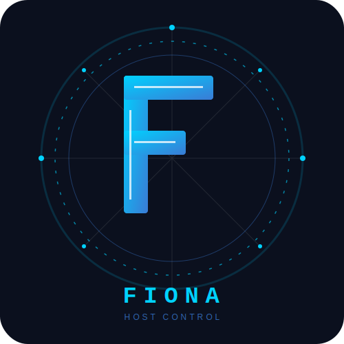

<section class="fiona-hero">
  <div class="fiona-logo-lockup">
    
    <div>
      <div class="fiona-eyebrow">Local host-control documentation</div>
      <h1>Fiona</h1>
    </div>
  </div>
  <p class="fiona-lede">
    Fiona is a local host-control project inspired by JARVIS-style workstation control. It is the software base for local actions, encrypted communication, desktop awareness, data tools, LM Studio inference, and a simple 3D hologram viewer.
  </p>
  <div class="fiona-actions">
    <a class="fiona-button primary" href="getting-started/">Get started</a>
    <a class="fiona-button" href="operations/cli/">CLI mechanics</a>
    <a class="fiona-button" href="operations/workflows/">System workflows</a>
  </div>
</section>

## What Fiona Provides

<div class="fiona-card-grid">
  <a class="fiona-card" href="modules/quiktieper/">
    <strong>QuikTieper</strong>
    <span>App launching, keyboard shortcuts, pointer control, and remote action execution.</span>
  </a>
  <a class="fiona-card" href="modules/camcoms/">
    <strong>CamComs</strong>
    <span>Encrypted messages, trusted sender storage, host receiver, and audit logging.</span>
  </a>
  <a class="fiona-card" href="modules/phiconnect/">
    <strong>PhiConnect</strong>
    <span>Standalone encrypted computer-to-computer chat using CamComs primitives.</span>
  </a>
  <a class="fiona-card" href="modules/dataclient/">
    <strong>DataClient</strong>
    <span>Research mining, bounded deep research, MiniExcel, and table conversion tools.</span>
  </a>
  <a class="fiona-card" href="modules/seeondesk/">
    <strong>SeeOnDesk</strong>
    <span>Desktop awareness for active app, active window, and session metadata.</span>
  </a>
  <a class="fiona-card" href="modules/eyecontrol/">
    <strong>EyeControl</strong>
    <span>Optional camera-based eye-controlled mouse tracker integration.</span>
  </a>
  <a class="fiona-card" href="modules/terminalassist/">
    <strong>TerminalAssist</strong>
    <span>btop-inspired fAT terminal dashboard and Zellij workspace helper.</span>
  </a>
  <a class="fiona-card" href="modules/vsee/">
    <strong>Vsee</strong>
    <span>3D point and edge wireframe viewer for early holography experiments.</span>
  </a>
  <a class="fiona-card" href="modules/agent/">
    <strong>Agent</strong>
    <span>LM Studio bridge for local OpenAI-compatible inference.</span>
  </a>
</div>

## Main Commands

```bash
python3 -m fiona.cli edit
python3 -m fiona.cli run
python3 -m fiona.cli camcoms smoke-test
python3 -m fiona.cli phiconnect
python3 -m fiona.cli dataclient
python3 -m fiona.cli vsee
python3 -m fiona.cli seeondesk status
```

After editable installation, `fiona ...` can be used instead of `python3 -m fiona.cli ...`.

## Documentation Map

- Start with [Getting Started](getting-started.md).
- Install from [Installation](installation.md).
- Understand package layout in [Architecture](architecture.md).
- Deep-dive into [CLI Mechanics](operations/cli.md), [GUI Mechanics](operations/gui.md), and [System Workflows](operations/workflows.md).
- Read each subsystem under [Modules](modules/quiktieper.md).
- Track implementation status in [Current State](current-state.md), [Roadmap](roadmap.md), and [Test Suites](developer/test-suites.md).
